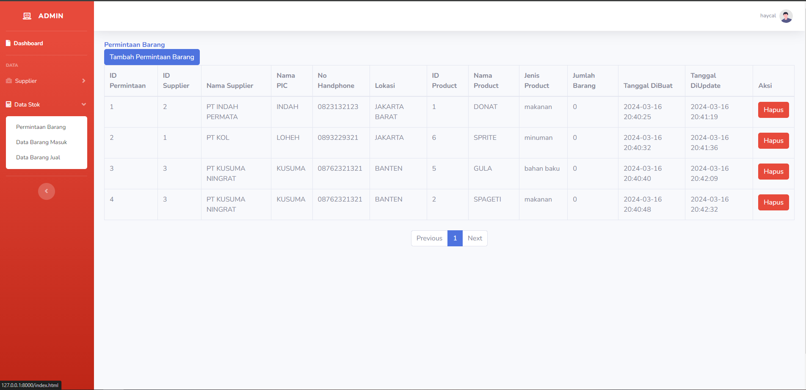

# Administrasi Barang Gudang

## Fitur

-   CRUD Admin: Deskripsi fitur CRUD .
-   Responsive Mobile: Deskripsi fitur responsif mobile.
-   Tersedia Cetak Laporan PDF

## Download Bahan Bahan

-   Xampp
-   Code Editor(Visual Studio Code / Cursor)
-   Composer

## Gambar

Anda dapat menampilkan gambar dalam bentuk daftar :

### Daftar Gambar

1. 
2. 
3. 
4. 
5. 
6. 
7. 

## Instalasi

Untuk menginstal proyek ini, ikuti langkah-langkah berikut:

1. Clone repositori ini ke dalam direktori lokal Anda:

    ```bash
    git clone https://github.com/haycalrh21/AdminsitrasiBarangGudang-laravel10.git
    ```

2. Masuk ke direktori proyek:

    ```bash
    cd AdminsitrasiBarangGudang-laravel10
    ```

3. Install dependensi PHP menggunakan Composer:

    ```bash
    composer install
    ```

## Penggunaan

-   php artisan migrate
-   php artisan db=seed --class=AdminSeeder
-   php artisan serve

## Kontak

hrayhansyah@gmail.com
